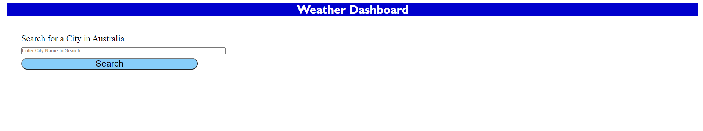
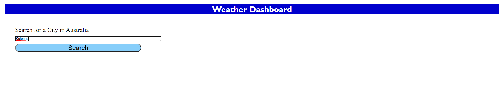
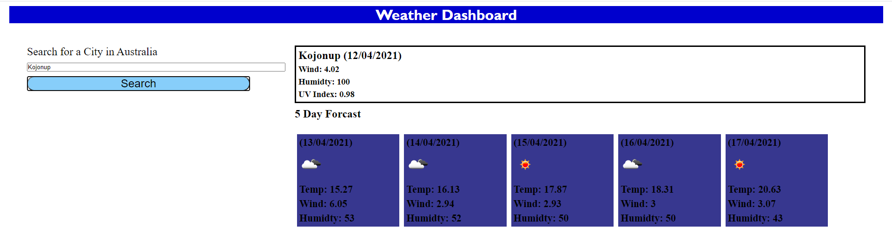
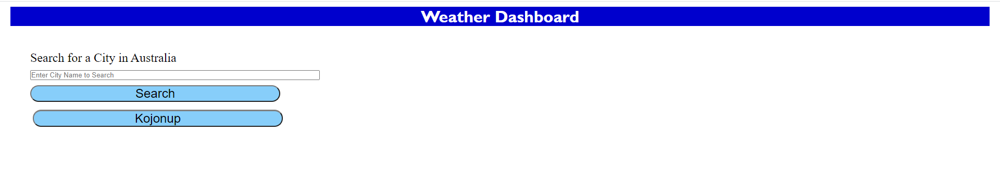
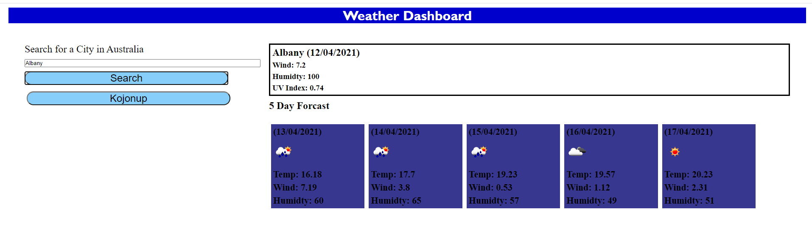
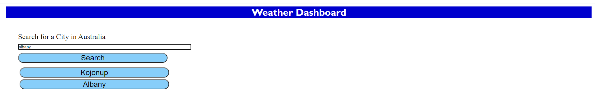
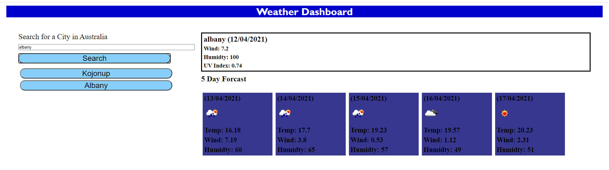
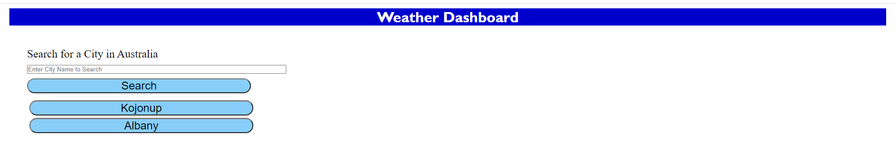

This application allows the user to search for the current weather and future five day forecast for a city/town in Australia.

The user can choose to enter a new city or select a city/town from a list of previous searches.

The data returned is in metrics, so temperature is in degrees Celsius.

Results of search for town/city is displayed in the following manner.

When the page is refreshed then previous searches are displayed.

A list of previous towns/cities searched is displayed and the usr can choose to select one of those entries and current weather data and five day forecast will be provided.

If the user enters a town/city name in lowercase, uppercase or a mixture of case the application will check that the town/city has not already been saved to
local storage previously.  It does this by taking the first letter of the town/city name and converting to Uppercase, the remainder of the town/city name is
converted to lowercase and then a comparision check against the towns/cities in local storage is undertaken.

The screen shot below shows that 'albany' is searched for even though 'Albany' is shown in the list of previous searches.

Results of search are:

Display of page after weather results are retrieved, showing that 'albany' has not been added to the list of previous searches.

